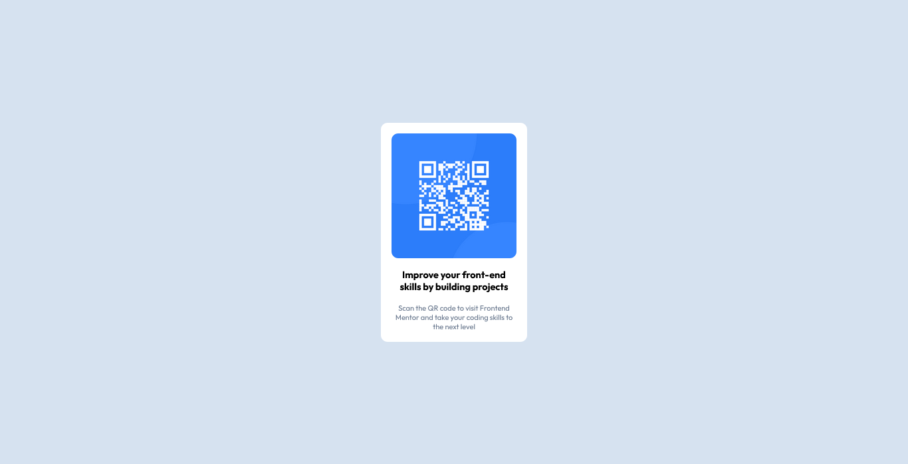

# Frontend Mentor - QR code component solution

This is a solution to the [QR code component challenge on Frontend Mentor](https://www.frontendmentor.io/challenges/qr-code-component-iux_sIO_H). Frontend Mentor challenges help you improve your coding skills by building realistic projects.

## Table of contents

- [Overview](#overview)
  - [Screenshot](#screenshot)
  - [Links](#links)
  - [Built with](#built-with)
  - [What I learned](#what-i-learned)
  - [Continued development](#continued-development)
  - [Useful resources](#useful-resources)
- [Author](#author)

**Note: Delete this note and update the table of contents based on what sections you keep.**

## Overview

This is a simple **QR Code Component** built using **HTML** and **CSS**, inspired by Frontend Mentor challenges. The project focuses on **responsive design**, utilizing **CSS Flexbox** and **media queries** to ensure proper display on different screen sizes.

## Features

- 📱 **Responsive Design**: Adapts to both **mobile (375px)** and **desktop (1440px)** screens.
- 🎨 **Modern UI**: Styled using **CSS variables** for a clean and consistent look.
- 🖋️ **Google Fonts Integration**: Uses the "Outfit" font for improved typography.
- 🖼️ **Rounded Borders**: Smoothly styled `border-radius` for a polished card-like appearance.

## Technologies Used

- ✅ **HTML5**
- ✅ **CSS3 (Flexbox, Media Queries, Custom Properties)**
- ✅ **Google Fonts**
- ✅ **Frontend Mentor Design Inspiration**

## How to Use

1. Clone the repository or download the project files.
2. Open `index.html` in a browser.
3. Scan the QR code to visit Frontend Mentor and improve your coding skills!

### Screenshot



### Links

- Solution URL: [Add solution URL here](https://github.com/shaheerahmedkhan11/qrcode-project)

### Built with

- Semantic HTML5 markup
- CSS custom properties
- Flexbox

### What I learned

Use this section to recap over some of your major learnings while working through this project. Writing these out and providing code samples of areas you want to highlight is a great way to reinforce your own knowledge.

To see how you can add code snippets, see below:

```html
<h1>Some HTML code I'm proud of</h1>


<figure>
  
  <p>Improve your front-end skills by building projects</p>
  <figcaption>
    <div class="attribution">
      Scan the QR code to visit Frontend Mentor and take your coding skills
      to the next level
    </div>
  </figcaption>
</figure>
```

```css
 ###Proud of this CSS
  figure {
  background-color: var(--White);
  padding: 1rem;
  margin: auto;
  width: 220px;
  height: auto;
  border-radius: 10px;
  display: flex;
  flex-flow: column nowrap;
  justify-content: center;
  align-content: center;
}
```

### Continued development

I want to continue to focus on _improving my css_ especially **flexbox and Media Queries**

### Useful resources

- [MDN Docs](https://developer.mozilla.org/en-US/) - This helped me to find out about how to use css properties. I really liked this and will use it going forward.

## Author

- Website - [Shaheer](https://www.your-site.com)
- Frontend Mentor - [@shaheerahmedkhan11](https://www.frontendmentor.io/profile/shaheerahmedkhan11)
